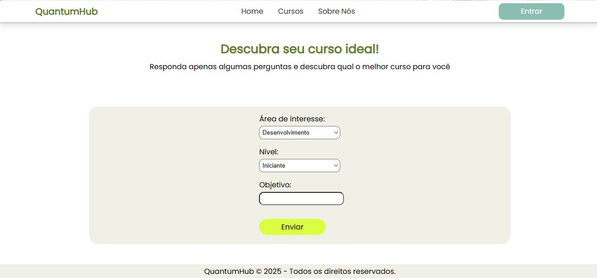
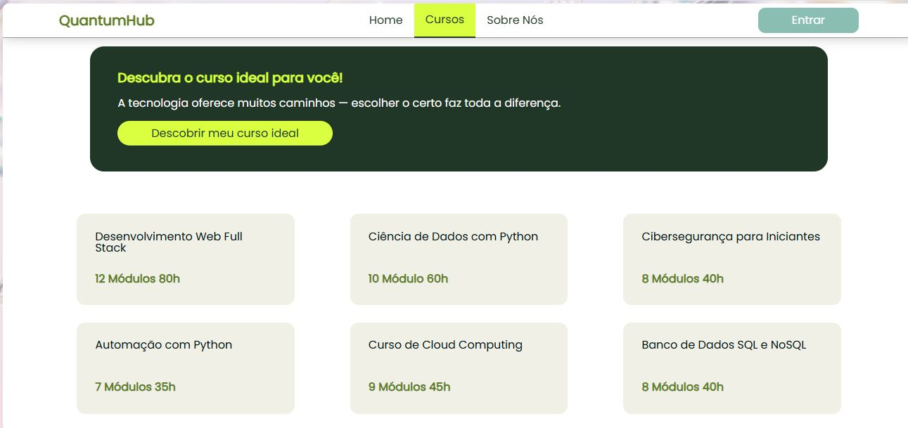

# 🌌 QuantumHub

> An EdTech platform designed to personalize technology learning paths through a dynamic recommendation engine.

At the speed tech market evolves, finding the right course for your current skill level and career goals often leads to information overload.

QuantumHub transforms the search for knowledge into a guided experience. Through a quick diagnostic tool, our application analyzes your preferences and points out the ideal path for your next professional step.

## ✨ Key Features

- 🔒 **Secure Authentication:** Credential protection using the `BCRYPT` algorithm (`password_hash`).
- 🎯 **Recommendation Engine:** Dynamic algorithm that analyzes areas of interest and knowledge levels.
- 📱 **Responsive Interface:** Design guided by *Mobile-First* concepts, ensuring usability across any device.
- 🗄️ **Relational Data Persistence:** Structured in MySQL for efficient management of user profiles and diagnostics.

## 📂 Project Structure Overview

- `config/`: Database Layer & Global Vars.
- `pages/`: User interfaces and views.
- `recomendacao.php`: Core decision logic and recommendation filters.
- `styles/`: Modular CSS (`reset.css`, `global.css`, `home.css`).

## ⚙️ How It Works

1. The user securely creates an account.
2. Fills out a diagnostic form (area of interest, experience level, and goals).
3. The PHP recommendation engine filters the course matrix and delivers the best tailored path.

## 🛠️ Tech Stack

## 📖 More Infos

| System Screenshots ||
|-|-|
| Home Page | Diagnostic Form |
|  | |
| Courses Page ||
|  ||

---

*Escola e Faculdade SENAI 106 "Mariano Ferraz" | Análise e Desenvolvimento de Sistemas (2025)*
